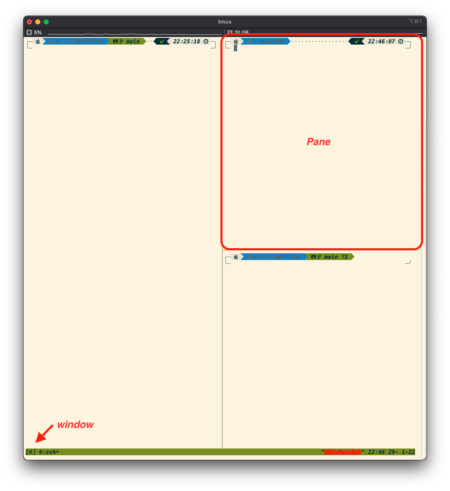

# tmux

## 安装

```sh
# ubuntu
$ sudo apt install -y tmux
# macOS
$ brew intsall tmux
```

## 基本使用

### 前缀

Tmux绝大多数的快捷键都是以 `<Prefix>` 前缀开始的。

> Tmux默认前缀是 `Ctrl+b`，可以通过自定义配置修改。

### 启动

在一个终端窗口输入tmux

```sh
$ tmux
```

### 面板Pane和窗口window和会话session



如图所示，一个工作区域叫做 Pane。

window可以理解为workspace，或者一个Desktop

一个window可以包含多个Pane，就好比在windows/macOS中一个桌面可以有多个窗口。

而所有的window都在一个session中，你可以同时打开多个session。

---

## 常用命令

```sh
#启动新session：
$ tmux [new -s 会话名 -n 窗口名]

#恢复session：
$ tmux at [-t 会话名]

#列出所有sessions：
$ tmux ls

#关闭session：
$ tmux kill-session -t 会话名

#关闭整个tmux服务器：
$ tmux kill-server
```

---

## 配置文件

### 配置文件加载
```sh
$ cp xx.conf ~/.tmux.conf
```

两种方式：

- 重启 tmux `restart tmux`
- 在 tmux 窗口中，`<prefix>+:`，进入到命令模式后输入 `source-file ~/.tmux.conf`，回车后生效。

### 配置项

#### 修改指令前缀
若要启用，取消注释即可。
```sh
#set -g prefix C-f #
#unbind C-f # C-b 即 Ctrl+b 键，unbind 意味着解除绑定
#bind C-f send-prefix # 绑定 Ctrl+f 为新的指令前缀

# 从tmux v1.6版起，支持设置第二个指令前缀
#set-option -g prefix2 ` # 设置一个不常用的`键作为指令前缀，按键更快些
```
#### 添加加载配置文件快捷指令 Ctrl+r
```sh
bind C-r source-file ~/.tmux.conf \; display-message "Config reloaded.."
```
#### 将切换窗口设置成vim模式

```sh
bind-key k select-pane -U # up

bind-key j select-pane -D # down

bind-key h select-pane -L # left

bind-key l select-pane -R # right
```
上面的最后一条语句会更改`<prefix>+l`的功能，我挺喜欢这个功能的，因为我们很时候都是在两个窗 口或这两个面板中切换，所以我又加入如下语句
```sh
bind-key C-l select-window -l
```
`<prefix>+l`是切换面板，Ctrl+x Ctrl+l切换窗口，Ctrl+l清屏

#### 支持鼠标
```sh
# 老版本：
#setw -g mode-mouse on # 支持鼠标选取文本等
#setw -g mouse-resize-pane on # 支持鼠标拖动调整面板的大小(通过拖动面板间的分割线)
#setw -g mouse-select-pane on # 支持鼠标选中并切换面板
#setw -g mouse-select-window on # 支持鼠标选中并切换窗口(通过点击状态栏窗口名称)

# v2.1及以上的版本
set-option -g mouse on
```

## 快捷键

### 系统指令

|`<prefix>`+指令|描述|
|:---:|:---|
|?|显示快捷键帮助文档|
|d|断开当前会话|
|D|选择要断开的会话|
|Ctrl+z|挂起当前会话|
|r|强制重载当前会话|
|s|显示会话列表用于选择并切换|
|:|进入命令行模式，此时可直接输入ls等命令|
|[|进入复制模式，按q退出|
|]|粘贴复制模式中复制的文本|
|~|列出提示信息缓存|

### 窗口window指令

|`<prefix>`+指令|描述|
|:---:|:---|
|c|新建窗口|
|&|关闭当前窗口|
|0~9|切换到指定窗口|
|p|切换到上一窗口|
|n|切换到下一窗口|
|w|打开窗口列表，用于且切换窗口|
|,|重命名当前窗口|
|.|修改当前窗口编号（适用于窗口重新排序）|
|f|快速定位到窗口（输入关键字匹配窗口名称）|

### 面板pane指令

|`<prefix>`+指令|描述|
|:---:|:---|
|"|当前面板上下一分为二，下侧新建面板|
|%|当前面板左右一分为二，右侧新建面板|
|x|关闭当前面板（关闭前需输入y or n确认）|
|z|最大化当前面板，再重复一次按键后恢复正常（v1.8版本新增）|
|!|将当前面板移动到新的窗口打开（原窗口中存在两个及以上面板有效）|
|;|切换到最后一次使用的面板|
|q|显示面板编号，在编号消失前输入对应的数字可切换到相应的面板|
|{|向前置换当前面板|
|}|向后置换当前面板|
|Ctrl+o|Ctrl+o	顺时针旋转当前窗口中的所有面板|
|方向键|移动光标切换面板|
|o|选择下一面板|
|空格键|在自带的面板布局中循环切换|
|Alt+方向键|以5个单元格为单位调整当前面板边缘|
|Ctrl+方向键|以1个单元格为单位调整当前面板边缘（Mac下)|
|t|显示时钟|