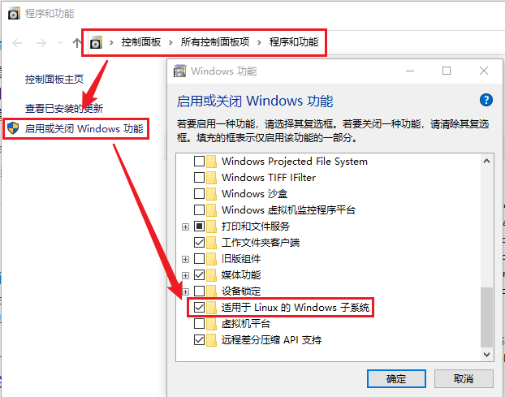
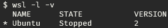
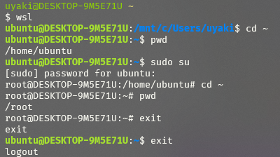

# windows 安装说明

- [windows 安装说明](#windows-安装说明)
  - [winget 安装](#winget-安装)
  - [chocolatey 安装](#chocolatey-安装)
  - [安裝wsl](#安裝wsl)
    - [步骤1 打开windows的wsl功能。](#步骤1-打开windows的wsl功能)
    - [步骤2 启用虚拟机功能](#步骤2-启用虚拟机功能)
    - [步骤3 下载 Linux 内核更新包](#步骤3-下载-linux-内核更新包)
    - [步骤4 选择并安装linux](#步骤4-选择并安装linux)
    - [步骤5 登录退出](#步骤5-登录退出)
  - [OpenSSL](#openssl)
  - [windows Terminal](#windows-terminal)
    - [下载字体Meslo](#下载字体meslo)

--- 

## winget 安装

请到 [winget官方](https://github.com/microsoft/winget-cli/releases) 查看最新可下载版本

```sh
## 下载
$ curl.exe -L -o $HOME/Downloads/winget.msixbundle https://github.com/microsoft/winget-cli/releases/download/v1.2.10271/Microsoft.DesktopAppInstaller_8wekyb3d8bbwe.msixbundle

## 安装winget
$ msiexec winget.msixbundle

## 查看版本
$ winget -v
```

---

## chocolatey 安装

> chocolatey [官网安装docs](https://docs.chocolatey.org/en-us/choco/setup)

以管理员身份运行powershell

```sh
$ Set-ExecutionPolicy Bypass -Scope Process -Force; [System.Net.ServicePointManager]::SecurityProtocol = [System.Net.ServicePointManager]::SecurityProtocol -bor 3072; iex ((New-Object System.Net.WebClient).DownloadString('https://community.chocolatey.org/install.ps1'))
```

> 如果中间因为网络等原因出现问题，第一次安装失败，只需删除`C:\ProgramData\chocolatey` 目录，再次执行安装命令即可

---

## 安裝wsl

### 步骤1 打开windows的wsl功能。

- 方式一：使用命令行（推荐）
  
以管理员身份打开 PowerShell（`“开始”菜单` -> `PowerShell` -> `单击右键` -> `以管理员身份运行`）并运行：
```sh
$ dism.exe /online /enable-feature /featurename:Microsoft-Windows-Subsystem-Linux /all /norestart
```

- 方式二：使用图形界面

具体操作路径：`控制面板` -> `所有控制面板项` -> `程序和功能` -> `启用或关闭Windows功能` -> 勾选✔️`适用于Linux的Windows子系统。`



重启电脑

### 步骤2 选择并安装linux

> [wsl官方文档](https://docs.microsoft.com/zh-cn/windows/wsl/install)

```sh
# 查看可安装版本 wsl --list --online
$ wsl -l -o

# 安装 ubuntu
## 下载完成之后，会要求配置初始的用户名和密码。
$ wsl --install -d  Ubuntu

# 升级成 wsl2
## WSL 2 是适用于 Linux 的 Windows 子系统体系结构的一个新版本，它支持适用于 Linux 的 Windows 子系统在 Windows 上运行 ELF64 Linux 二进制文件。 它的主要目标是提高文件系统性能，以及添加完全的系统调用兼容性
## 可以使用 wsl -l -v 查看是否需要更换wsl2 这可能是因为你在升级wsl2之前就已经安装了子系统
$ wsl --set-version Ubuntu 2
```


### 步骤3 登录退出

```sh
$ wsl
```



### 用户相关

1. 创建用户目录
> 登录到 root 用户．假如你之前没有设置过 root 用户，那么你就通过以下命令更改密码：
> ```
> sudo passwd root
> ```

2. 登录root 
```
su root
```

3. 创建新用户
```
# -r：建立系统账号
# -m：自动建立用户的登入目录
# -s：指定用户登入后所使用的 shell
sudo useradd -r -m -s /bin/bash uyaki

# 在 Ubuntu18.04 中，不会在创建用户的时候自动提示设置密码。需要手动执行：
sudo passwd uyaki
```

4. 修改用户权限

> 采用修改 / etc/sudoers 文件的方法分配用户权限。因为此文件只有 r 权限，在改动前需要增加 w 权限，改动后，再去掉 w 权限

```
sudo chmod +w /etc/sudoers
sudo vim /etc/sudoers
# 添加下图的配置语句，并且保存修改
sudo chmod -w /etc/sudoers
```


之后的操作见 [ubuntu-install.md](../linux/ubuntu-install.md)

---

## OpenSSL

TODO

---

## windows Terminal

### 下载字体Meslo

[字体字体安装教程](./../font/font.md)
